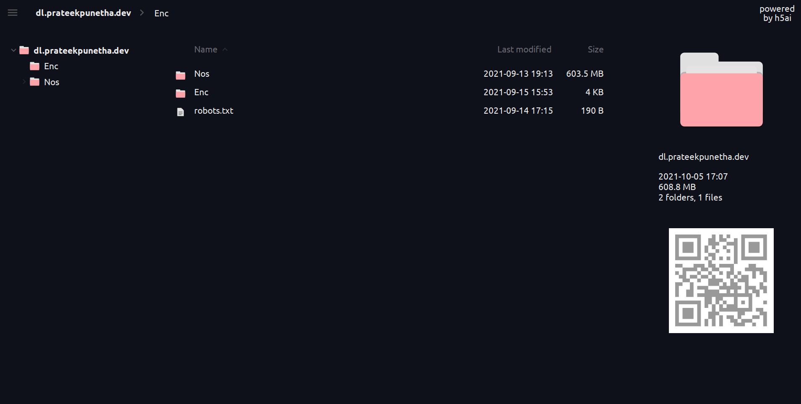

# h5ai-theme

### Requirements

- Latest version of [h5ai](https://larsjung.de/h5ai/)

### Installation

- Download or clone this repo
- copy style sheet `cp css/styles.css _h5ai/public/css/`
- copy icons `cp -r icons/material-ocean _h5ai/images/themes/`
- copy config for icons `cp conf/types.json _h5ai/private/conf/`
- set `theme` to `material-ocean` in your `_h5ai/private/conf/options.json`
